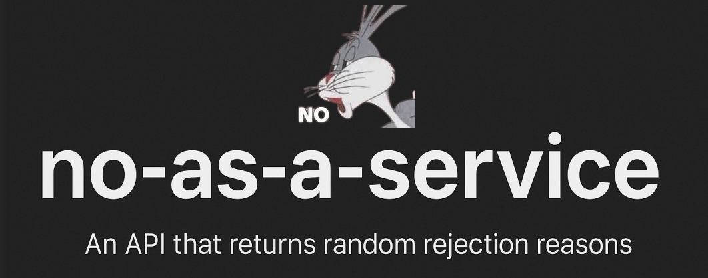

# ❌ Nein-als-Service

<p align="center">
  
</p>

Brauchst du mal eine elegante Art, „Nein“ zu sagen?
Diese kleine API liefert zufällige, allgemeine, kreative und manchmal urkomische Ablehnungsgründe — perfekt für jede Situation: privat, beruflich, Studentenleben, Entwickleralltag oder einfach nur so.

Gemacht für Menschen, Ausreden und Humor.

Übersetzt und erweitert nach dem Original-Projekt [no-as-a-service](https://github.com/hotheadhacker/no-as-a-service) von hotheadhacker.

---

## 🚀 API-Nutzung

**Basis-URL (lokal)**
```
http://localhost:3000/nein
```

**Methode:** `GET`
**Rate-Limit:** `120 Anfragen pro Minute pro IP`

### 🔄 Beispiel-Anfrage
```http
GET /nein
```

### ✅ Beispiel-Antwort
```json
{
  "grund": "Das fühlt sich an wie etwas, für das mein zukünftiges Ich mein jetziges Ich anschreien würde."
}
```

Nutze es in Apps, Bots, Landingpages, Slack-Integrationen, Absagebriefen oder überall dort, wo du ein höfliches (oder freches) Nein brauchst.

---

## 🛠️ Selbst hosten

Du willst es selbst betreiben? Kein Problem, es ist schlank und einfach.

### 1. Repository klonen
```bash
git clone <URL-deines-Repos>
cd nein-als-service
```

### 2. Abhängigkeiten installieren
```bash
npm install
```

### 3. Server starten
```bash
npm start
```

Die API läuft dann unter:
```
http://localhost:3000/nein
```

Du kannst den Port auch über eine Umgebungsvariable ändern:
```bash
PORT=5000 npm start
```

---

## 📁 Projektstruktur

```
nein-als-service/
├── index.js            # Express-API
├── gruende.json        # 1000+ deutsche Ablehnungsgründe
├── package.json
├── .devcontainer.json  # VS Code / GitHub Devcontainer-Setup
└── README.md
```

---

## 📦 package.json

Zur Referenz hier die package-Konfiguration:

```json
{
  "name": "nein-als-service",
  "version": "1.0.0",
  "description": "Eine schlanke API, die zufällige Ablehnungs- und Nein-Gründe liefert.",
  "main": "index.js",
  "scripts": {
    "start": "node index.js"
  },
  "author": "hotheadhacker",
  "license": "MIT",
  "dependencies": {
    "express": "^4.18.2",
    "express-rate-limit": "^7.0.0"
  }
}
```

---

## ⚓ Devcontainer

Wenn du dieses Repo in GitHub Codespaces öffnest, wird automatisch `.devcontainer.json` verwendet, um deine Umgebung einzurichten. In VS Code wirst du gefragt, ob du es im Container neu öffnen möchtest.

---

## 👤 Autor

Original erstellt mit kreativer Sturheit von [hotheadhacker](https://github.com/hotheadhacker).
Deutsche Übersetzung und Erweiterung um zusätzliche Sprüche für dieses Projekt.

---

## 📄 Lizenz

MIT — mach damit, was du willst, sag nur nicht Ja, wenn du eigentlich Nein sagen solltest.

---

## 🐧 Stimmen aus dem Netz

> „Ich habe versucht, Nein-als-Service in den Linux-Kernel einzubauen, um schlechte Patches automatisch abzulehnen — jetzt lehnt es auch meine eigenen Commits ab. 10/10, absolut gnadenlos.“
>
> — **Linus Torvalds** (wahrscheinlich)
